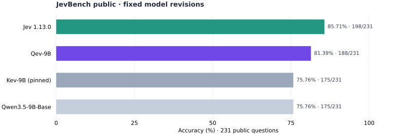

<div align="center">
  
  <p><strong>Qwen-based decision models with candidate branches and a shared decision head.</strong></p>
  <p><a href="README.zh-CN.md">中文</a> · <a href="#quick-start">Quick start</a> · <a href="docs/architecture.md">Architecture</a> · <a href="docs/evaluation.md">Evaluation</a> · <a href="docs/training.md">Training</a></p>
</div>

Qev scores the choices you give it. Supply a shared context, questions, and candidate answers; get a probability distribution for each question. The same model handles categorical choices, yes/no judgments, and ordered ratings.

**Qev-9B** fine-tunes **Qwen3.5-9B-Base** with rank-64 LoRA, candidate-specific readouts, and a 256-dimensional decision head. On the 231 public JevBench questions, the selected checkpoint answers **188 correctly (81.39%)**, compared with **175 (75.76%)** for the pinned Kev-9B baseline and **198 (85.71%)** for Jev. [Protocol and provenance →](docs/evaluation.md)

This repository contains the model, training and evaluation code, portable checkpoint tools, tests, and reproducible examples. Qev was called **BranchKev** during research; its existing record and checkpoint formats remain readable. A public model-hosting URL has not been assigned yet. The selected checkpoint can be exported locally using the instructions below; the full research training corpus is not bundled.

## Quick start

Use Python 3.12 and install PyTorch 2.8.0 for your hardware. From this checkout:

```bash
python -m pip install -e '.[test]'
```

**Try the complete pipeline on CPU, without downloading a model:**

```bash
python scripts/smoke.py --out runs/smoke
```

This creates a tiny random Qwen model, prepares the included examples, trains, resumes, and predicts. It checks the software pipeline; its predictions are not Qev-9B quality measurements.

**Run a trained checkpoint:** put an exported Qev checkpoint in `checkpoints/qev-9b`, then:

```bash
python -m qev.predict \
  --checkpoint checkpoints/qev-9b \
  --input examples/requests.jsonl \
  --out runs/predictions.jsonl \
  --device cuda --weights-dtype checkpoint
```

Outputs are created in a new file. For the reference execution used in the reported Qev results, add `--reference`. A pinned Hub checkpoint can also be supplied as `owner/repository@commit` once hosted; Qev downloads the inference artifacts and loads the specified Qwen base. [Checkpoint export and loading →](docs/checkpoints.md)

### Python

```python
from qev import Qev

model = Qev.from_pretrained("checkpoints/qev-9b", device="cuda")
answers = model.predict({
    "state": "I was charged twice. Please help immediately.",
    "questions": {
        "department": {
            "type": "choice",
            "instructions": "Which team should handle this request?",
            "criteria": {
                "billing": "Charges and refunds",
                "shipping": "Delivery and tracking",
                "account": "Sign-in and account access",
            },
        },
        "urgent": {
            "type": "noul",
            "instructions": "Does the message explicitly request immediate help?",
        },
        "priority": {
            "type": "score",
            "instructions": "Rate the requested response speed.",
            "criteria": ["No urgency stated", "Soon", "Immediately"],
        },
    },
})
print(answers["department"]["probabilities"])
print(answers["urgent"]["noul"])       # P(true)
print(answers["priority"]["score"])   # Expected zero-based level
```

Each answer includes `prediction` and `probabilities`. Choice adds `choice`, Noul adds `noul`, and Score adds `score`. [Input and output contract →](docs/data.md)

## How it works


A request forms a tree: **state → question → candidate**. Each candidate has its own causal branch and terminal readout marker. Question readouts summarize the state and question; candidate readouts summarize the corresponding branch. The final Qwen attention layer can also let a candidate readout attend to sibling candidates through a learned gate.

The decision head turns these summaries into scores:

1. **Project each vector.** Apply the same LayerNorm and linear projection to the question and every candidate, mapping 4,096 channels to 256. Add a learned role vector to the question. This step operates on each vector independently.
2. **Compare within the question.** Stack the question and its K candidates into `[1, K+1, 256]`. Two Transformer layers let these vectors exchange information. There are no candidate-index embeddings, positional encodings, or causal masks inside this head.
3. **Score each candidate with one shared function.** Concatenate each updated candidate with the updated question into 512 channels. Apply `LayerNorm → Linear(512,256) → GELU → Linear(256,1)`. K controls the number of input rows; the scorer always produces one scalar per row.
4. **Normalize across candidates.** Softmax gives the decision distribution. Yes/no uses two candidates; a rating uses the rubric's ordered levels.

The scorer is shared across candidates and task types. Reordering the same candidate IDs and text permutes the outputs in ideal arithmetic. Adding or removing an option can change the contextual representations and probabilities.

Qev includes a full-path reference implementation, prefix-cache inference, and tree execution with branched DeltaNet state. The set head and joint-attention reductions stay in FP32 while the backbone uses BF16; the exported LoRA tensors are FP32.

[Detailed architecture and equations](docs/architecture.md) · [Interactive Chinese explanation](docs/decision-head.html#set-head)

## Evaluation

Accuracy (%), using the pinned models and protocols described in [evaluation.md](docs/evaluation.md). **Clean** rows match the clean-subset reporting convention in Kev's README.

| Benchmark | Qev-9B | Kev-9B | Qwen3.5-9B-Base | Jev |
|---|---:|---:|---:|---:|
| Decision development · clean | **87.42** | 87.18 | 77.69 | 84.49 |
| Transfer development · clean | 83.99 | 82.16 | 74.39 | **85.67** |
| MMLU-Pro · 1,000 | 54.60 | 51.10 | 50.40 | **83.50** |
| SemIf · 144 handwritten | 93.75 | 90.97 | 90.28 | **96.53** |
| scienthoon · 873 | 72.28 | **75.49** | 68.84 | 75.26 |
| WANLI · 256 | 72.66 | 70.31 | 67.97 | **75.78** |
| JevBench public · 231 | 81.39 | 75.76 | 75.76 | **85.71** |



JevBench was run locally for all four models, with Jev accessed through its hosted API. Kev and Jev numbers on the other suites come from the pinned Kev author's reports. Kev uses FP32; Qev and the base baseline use BF16. Kev's eight unanswered MMLU-Pro questions count as incorrect. This is **public-set argmax accuracy**, not the official JevBench composite score.

The selected Qev checkpoint uses one seed. Data, LoRA rank, and training differ from Kev; these results do not isolate the effect of the architecture. In our single-seed ablations, disabling the final candidate interaction and set-head attention produced comparable accuracy. Qev also trails Kev on scienthoon. [Full results, ablations, and limits →](docs/evaluation.md)

## Train on your data

Start with the request format above, adding a `label` to each question. Choice labels are candidate IDs, Noul labels are booleans, and Score labels are zero-based level indices. Related examples should share a `group_id`.

```bash
python -m qev.prepare \
  --input examples/train.jsonl --validation examples/dev.jsonl \
  --out data/support

# Initialize from the exported Qev-9B adapter and head; use new optimizer state.
python -m qev.train \
  --config configs/qev-9b-finetune.json \
  --data data/support --out runs/support \
  --init-checkpoint checkpoints/qev-9b
```

The examples demonstrate the format; they are far too small to establish model quality. `--init-checkpoint` starts a new training run on new data. `--resume` continues a run with its optimizer, schedule, and original data checks. To start from Qwen itself, omit `--init-checkpoint`.

The reported Qev-9B recipe is in [configs/qev-9b.json](configs/qev-9b.json): four GPUs, global batch 32, two epochs, rank 64, seed 17, and a repeated late-training partition. It expects the research dataset partitions, which are separate from the toy examples. [Training recipes](docs/training.md) · [Data composition and availability](docs/data.md)

## Reproduce and contribute

```bash
python -m pytest -q
python scripts/check_release.py
```

Tests cover candidate permutation, question isolation, full/cache/tree agreement, gradients, training/resume, portable checkpoints, and data split guards. FSDP tests require two CUDA GPUs; CPU runs skip those tests. The exact checks performed for this source release are recorded in [validation.md](docs/validation.md).

See [CONTRIBUTING.md](CONTRIBUTING.md) for changes and [the model card](docs/model-card.md) for Qev-9B's identity, limits, and release status.

## Acknowledgments and license

Qev builds on Qwen and is inspired by [Jared Palmer's Kev](https://github.com/jaredpalmer/kev). Its delimiter convention, rendering conventions, LoRA targets, and cache-fork approach adapt Kev's Apache-2.0 implementation. Qev's candidate branches, set readout, and training pipeline were developed in the research workspace recorded in [provenance.json](provenance.json).

Code is licensed under [Apache-2.0](LICENSE). See [NOTICE](NOTICE) for attribution. Model weights and datasets retain their respective licenses; source-code publication does not redistribute the full research corpus.
