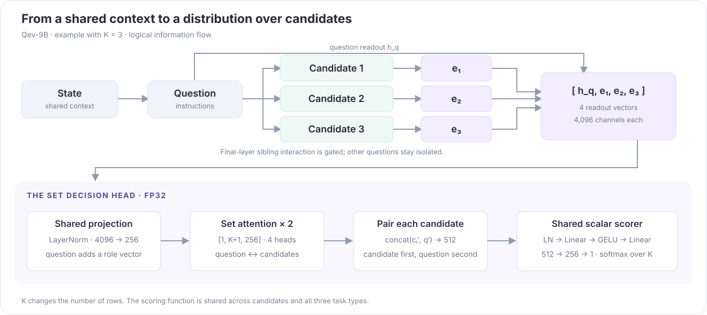

<p align="center">
  
</p>

<p align="center">
  <a href="pyproject.toml"></a>
  <a href="docs/model-card.md"></a>
  <a href="LICENSE"></a>
</p>

<p align="center"><strong>English</strong> | <a href="README.zh-CN.md">简体中文</a> | <a href="https://huggingface.co/AustinFu/Qev-9B">🤗 Model weights</a></p>

**Qev fine-tunes Qwen into a decision model.** Give it context, a question, and candidate answers; get a choice and a probability for every option. One model handles **Choice**, **Noul** (yes/no), and **Score** (ordered ratings).

This repository provides the model architecture, training and evaluation code, Python interface, and checkpoint tools. Train on your own examples or load a Qev checkpoint for inference.

| Start here | What you can do |
|---|---|
| **[Get model weights](#model-and-checkpoints)** | Find the released Qev-9B checkpoint and download details |
| **[Run a model](#inference)** | Get decisions and option probabilities through Python or JSONL |
| **[Train a model](#training)** | Prepare labelled data, train from Qwen, or fine-tune an existing Qev checkpoint |

## Model and checkpoints

| Model | Base and architecture | Availability |
|---|---|---|
| **Qev-9B** | Qwen3.5-9B-Base, rank-64 LoRA, two-layer 256-dimensional set head | [Hugging Face · v0.1.0](https://huggingface.co/AustinFu/Qev-9B/tree/v0.1.0) |

The approximately 690 MiB checkpoint downloads automatically; the loader fetches the pinned Qwen base separately. See [checkpoint export and loading](docs/checkpoints.md) for local downloads and base-model cache overrides. The [model card](docs/model-card.md) describes the released model.

The selected checkpoint is seed 17, step 2327. It was called BranchKev during research; those record and checkpoint formats remain readable. An inference export contains LoRA, the decision head, joint gate, tokenizer and metadata, excluding base weights and optimizer state.

## Installation

Use Python 3.12. From the repository root, create an environment, install a hardware-compatible PyTorch 2.8.0 build inside it, then install Qev:

```bash
python3.12 -m venv .venv
source .venv/bin/activate
# Install the PyTorch 2.8.0 build for your hardware in this environment first.
python -m pip install -e .
```

For development and testing, use `python -m pip install -e '.[test]'`. You can first check the complete pipeline on CPU without downloading a model:

```bash
python scripts/smoke.py --out runs/smoke
```

This uses a tiny random Qwen to exercise data preparation, training, resume and inference. See the [training guide](docs/training.md) for environment and device details.

## Inference

### Python API

Load the model once in your process, then submit requests:

```python
from qev import Qev

model = Qev.from_pretrained(
    "AustinFu/Qev-9B", revision="v0.1.0", device="cuda"
)
answers = model.predict({
    "state": "I was charged twice. Please help immediately.",
    "questions": {
        "department": {
            "type": "choice",
            "instructions": "Which team should handle this?",
            "criteria": {"billing": "Charges and refunds", "shipping": "Delivery problems"},
        }
    },
})
print(answers["department"]["choice"])
print(answers["department"]["probabilities"])
```

Use `noul` for a yes/no question and receive `P(true)`. Use `score` for a rubric and receive its level distribution and expectation. [All three tasks](examples/requests.jsonl) · [Input/output contract](docs/data.md).

### JSONL inference

```bash
python -m qev.predict \
  --checkpoint AustinFu/Qev-9B@v0.1.0 \
  --input examples/requests.jsonl --out runs/predictions.jsonl \
  --device cuda --weights-dtype checkpoint
```

The default uses shared-prefix caching. Add `--reference` for the execution used in the reported evaluation. Output files must be new; precision and length options are in the [loading guide](docs/checkpoints.md).

## Training

### Prepare data

Training examples use the same `state` and `questions` as inference, with a `label` on each question. Choice labels are candidate IDs, Noul labels are booleans, and Score labels are zero-based level indices. Related records should share a `group_id`.

| Data | Contents | Entry point |
|---|---|---|
| Included examples | Six training and two validation requests, covering all three tasks | [examples/](examples/README.md) |
| Your data | Labelled or soft-target JSONL requests | [Data format](docs/data.md) |
| Research recipe | 34,546 main and 1,783 late records; the full corpus is not bundled | [Composition and availability](docs/data.md#research-recipe-and-availability) |

```bash
python -m qev.prepare \
  --input examples/train.jsonl --validation examples/dev.jsonl \
  --out data/support
```

Without an explicit validation file, the preparer splits by group deterministically. It checks train/dev overlap in IDs, groups and exact inputs. The small included examples demonstrate the workflow; they cannot establish training gains.

### Supervised fine-tuning

On a CUDA GPU, initialize a new domain-training run from a Qev-9B checkpoint:

```bash
python -m qev.train \
  --config configs/qev-9b-finetune.json \
  --data data/support --out runs/support \
  --init-checkpoint AustinFu/Qev-9B@v0.1.0
```

`--init-checkpoint` loads model parameters and starts a fresh optimizer and schedule. `--resume` continues the same run with its original data checks. Omit initialization to start from the Qwen base in the configuration.

The [formal four-GPU recipe](configs/qev-9b.json) uses rank 64, global batch 32, two epochs, and a late-training partition. Single-GPU use, distributed training, resume and full fine-tuning are documented in the [training guide](docs/training.md).

## Demos

Recorded Snake and Crafter decision replays showing action selection and candidate probabilities in the environment. Click either animation for the MP4 version. The recordings retain the research name, BranchKev, in their interface.

<table>
  <tr>
    <td width="50%" align="center">
      <a href="assets/demos/snake.mp4"></a>
      <br><strong>Snake · Sequential action selection</strong>
    </td>
    <td width="50%" align="center">
      <a href="assets/demos/crafter.mp4"></a>
      <br><strong>Crafter · Survival and crafting</strong>
    </td>
  </tr>
</table>

[Recording details](docs/demos.md).

## How decisions are made

<p align="center">
  
</p>

Qev organizes inputs as **state → question → candidate**. Candidate branches read the shared context and produce their own summaries. The set head combines the question and option summaries, using the same scoring function for variable numbers of options. The implementation provides full causal reference execution, prefix caching, and tree execution with branched DeltaNet state.

[Architecture and equations](docs/architecture.md) · [Interactive Chinese decision-head walkthrough](docs/decision-head.html#set-head)

## Evaluation

**Precision: Qev-9B uses BF16 backbone computation; Kev-9B uses FP32.** Qev's decision head remains in FP32.

<p align="center">
  
</p>

| Benchmark | Jev (reference) | Qwen3.5-9B-Base | Qev-9B | Kev-9B |
|---|---:|---:|---:|---:|
| Decision development · clean | 84.49 | 77.69 | **87.42** | 87.18 |
| Transfer development · clean | 85.67 | 74.39 | **83.99** | 82.16 |
| MMLU-Pro · 1,000 | 83.50 | 50.40 | **54.60** | 51.10 |
| SemIf · 144 handwritten | 96.53 | 90.28 | **93.75** | 90.97 |
| scienthoon · 873 | 75.26 | 68.84 | 72.28 | **75.49** |
| WANLI · 256 | 75.78 | 67.97 | **72.66** | 70.31 |
| JevBench public · 231 | 85.71 | 75.76 | **81.39** | 75.76 |

Accuracy (%). Bold marks the higher score between Qev and Kev; Jev and the Qwen base are references.

Qev-9B answers **188/231 public JevBench questions (81.39%)** correctly, compared with 175/231 (75.76%) for Kev-9B. These are public-set accuracies, not the official JevBench composite score.

[Full results, ablations and settings](docs/evaluation.md) · [Machine-readable metrics](results/benchmarks.json) · [All 231 predictions](results/qev-9b/jevbench-predictions.jsonl)

## Documentation and contributions

[Architecture](docs/architecture.md) · [Training](docs/training.md) · [Checkpoints](docs/checkpoints.md) · [Data and outputs](docs/data.md) · [Evaluation](docs/evaluation.md) · [Contributing](CONTRIBUTING.md)

Run `python -m pytest -q` and `python scripts/check_release.py` to check the code and documentation. The [validation record](docs/validation.md) lists the actual checks and GPU skips.

Qev builds on Qwen and adapts delimiter, rendering, LoRA-target and cache-fork conventions from [Jared Palmer's Kev](https://github.com/jaredpalmer/kev). Code is licensed under [Apache-2.0](LICENSE); see [NOTICE](NOTICE) and [provenance.json](provenance.json) for attribution. Weights and datasets retain their respective terms.

## Acknowledgments

We thank the following projects and author for their work and inspiration:

- **BranchKev**: the research work on candidate-branch encoding, decision heads and training workflows provided the foundation for Qev's standalone release. See [NOTICE](NOTICE) and [provenance.json](provenance.json) for the code lineage.
- **[Jev / the TypeSafe team](https://typesafe.ai/)**: thank you for advancing decision models and providing [public API documentation](https://docs.typesafe.ai/introduction) for typed decisions and probability outputs.
- **[Archer Hume — Jev’s Architecture Unmasked](https://archerhume.com/posts/jevs-architecture-unmasked/)**: thank you for the independent API experiments and architectural analysis, offering useful perspectives on shared-state computation, question isolation and interactions between candidate answers.
