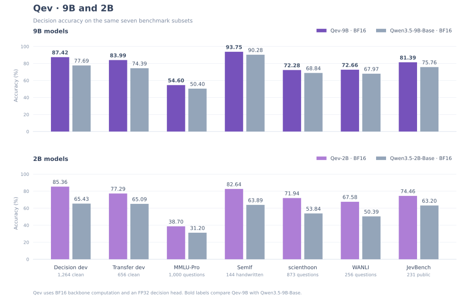
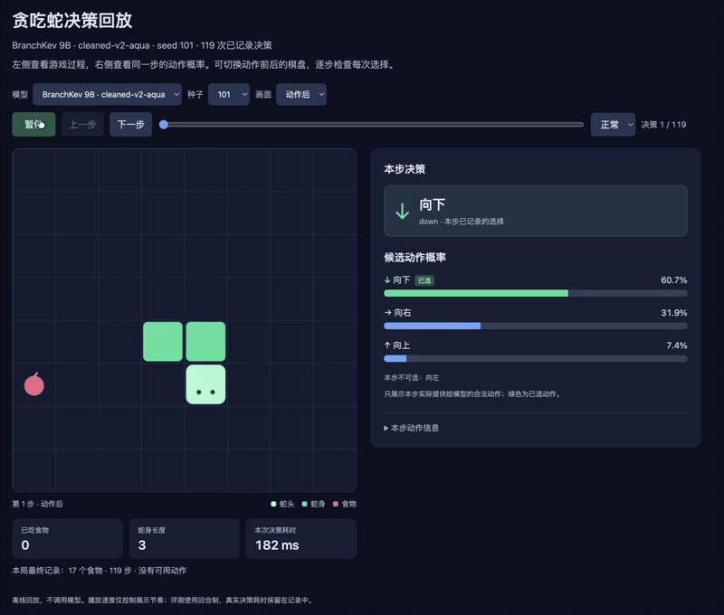
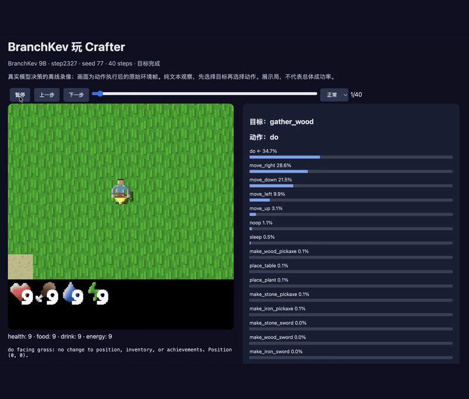
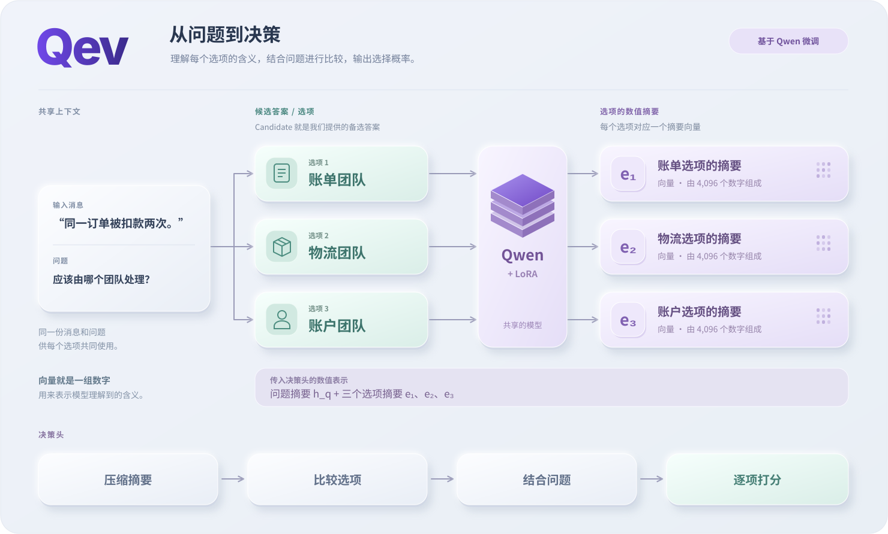

<p align="center">
  
</p>

<p align="center">
  <a href="pyproject.toml"></a>
  <a href="docs/model-card.md"></a>
  <a href="LICENSE"></a>
</p>

<p align="center"><a href="README.md">English</a> | <strong>简体中文</strong> | <a href="https://huggingface.co/AustinFu/Qev-2B">🤗 Qev-2B</a> | <a href="https://huggingface.co/AustinFu/Qev-9B">🤗 Qev-9B</a> | <a href="https://huggingface.co/datasets/AustinFu/Qev-train">🤗 训练数据</a></p>

**Qev 是从 Qwen 微调而来的决策模型。** 给定上下文、问题和候选答案，模型直接返回选择及各选项的概率。同一套模型支持 **Choice 选择、Noul 是非判断、Score 序数评分**。

本仓库提供模型架构、训练与评测代码、Python 接口和检查点工具。你可以在自己的数据上训练，也可以加载已有的 Qev 检查点进行推理。

| 从这里开始 | 可以做什么 |
|---|---|
| **[获取模型权重](#模型与检查点)** | 比较 Qev-2B 与 Qev-9B，查看检查点与下载说明 |
| **[运行模型](#推理)** | 通过 Python 或 JSONL 接口，获取选项概率和决策 |
| **[训练模型](#训练)** | 准备标注数据，从 Qwen 底座训练，或在 Qev 检查点上继续微调 |

<p align="center">
  
</p>

| 选择模型 | Qev-2B | Qev-9B |
|---|---|---|
| 定位 | 从 9B 蒸馏的轻量学生模型 | 决策模型与蒸馏教师 |
| 使用 | [2B 模型权重](https://huggingface.co/AustinFu/Qev-2B) | [9B 模型权重](https://huggingface.co/AustinFu/Qev-9B) |

## 模型与检查点

| 模型 | 底座与结构 | 当前入口 |
|---|---|---|
| **Qev-2B** | Qwen3.5-2B-Base，rank-64 LoRA，256 维两层决策头 | [Hugging Face · 下载](https://huggingface.co/AustinFu/Qev-2B) |
| **Qev-9B** | Qwen3.5-9B-Base，rank-64 LoRA，256 维两层集合决策头 | [Hugging Face · 下载](https://huggingface.co/AustinFu/Qev-9B) |

Qev-9B v0.2.0 在通用决策主集中加入 HelpSteer3 Principle 和 600 道合成边界题，并在训练后半程混入对齐题与文档规则判断题，重复学习三次。下载包包含 LoRA、决策头、候选交互参数、tokenizer 和模型配置。

Qev-2B 通过教师概率蒸馏、程序化的随机文本编辑，以及内部表示变化的蒸馏，从 Qev-9B 学习。适配权重包会自动下载：**2B 约 284 MiB，9B 约 690 MiB**，加载器另行获取对应的 Qwen 底座。本地下载与导出见[检查点指南](docs/checkpoints.md)，完整模型信息见 [2B 模型卡](docs/model-card-2b.md)和 [9B 模型卡](docs/model-card.md)。

## 安装

使用 Python 3.12。在仓库根目录创建环境，激活后安装适合硬件的 PyTorch 2.8.0，再安装 Qev：

```bash
python3.12 -m venv .venv
source .venv/bin/activate
# 先在这个环境中安装适合硬件的 PyTorch 2.8.0。
python -m pip install -e .
```

开发和测试使用 `python -m pip install -e '.[test]'`。确认环境后，可先运行无需下载模型的 CPU 短试跑：

```bash
python scripts/smoke.py --out runs/smoke
```

它使用随机初始化的小型 Qwen 验证数据准备、训练、续训和推理流程；完整安装与设备说明见[训练文档](docs/training.md)。

## 推理

### Python 接口

模型在进程内加载一次，随后可以反复提交请求：

```python
from qev import Qev

# 可选择 "AustinFu/Qev-2B" 或 "AustinFu/Qev-9B"。
model = Qev.from_pretrained(
    "AustinFu/Qev-9B", device="cuda"
)
answers = model.predict({
    "state": "同一订单被扣款两次，请立即处理。",
    "questions": {
        "department": {
            "type": "choice",
            "instructions": "应该由哪个团队处理？",
            "criteria": {"billing": "账单和退款", "shipping": "物流配送"},
        }
    },
})
print(answers["department"]["choice"])
print(answers["department"]["probabilities"])
```

是非问题使用 `noul`，返回 `P(true)`；评分问题使用 `score`，返回等级分布及其期望。[三种任务的完整示例](examples/requests.jsonl)与[输入输出约定](docs/data.md)。

### JSONL 批量推理

```bash
python -m qev.predict \
  --checkpoint AustinFu/Qev-9B \
  --input examples/requests.jsonl --out runs/predictions.jsonl \
  --device cuda --weights-dtype checkpoint
```

默认使用共享前缀缓存；复现正式评测的执行路径时加 `--reference`。输出文件使用新名字，精度与长度选项见[加载说明](docs/checkpoints.md)。

## 训练

### 准备数据

训练数据沿用推理请求中的 `state` 和 `questions`，在每个问题上增加 `label`。Choice 填候选 ID，Noul 填布尔值，Score 填从 0 开始的等级编号。相关样本应共用 `group_id`。

| 数据 | 内容 | 入口 |
|---|---|---|
| 随包示例 | 6 条训练请求、2 条验证请求，覆盖三种任务 | [examples/](examples/README.md) |
| **Qev-train** | **2,442 条合成训练题**：对齐题、文档规则、世界知识与受控边界题 | [数据集与合成方法](https://huggingface.co/datasets/AustinFu/Qev-train/blob/main/README.zh-CN.md) |
| 自己的数据 | 带标签或软目标的 JSONL 请求 | [数据格式](docs/data.md) |
| 正式研究配方 | 主分区 39,605 条，收尾分区 1,783 条；完整数据尚未随代码分发 | [数据构成](docs/data.md#research-recipe-and-availability) |

```bash
python -m qev.prepare \
  --input examples/train.jsonl --validation examples/dev.jsonl \
  --out data/support
```

未提供独立验证文件时，工具按 `group_id` 做确定性划分，并检查训练／验证之间的 ID、分组和精确输入重合。随包示例用于熟悉流程，数量不足以评价训练收益。

### 监督微调

在 CUDA GPU 上，从已有的 Qev-9B 检查点开始新的领域训练：

```bash
python -m qev.train \
  --config configs/qev-9b-finetune.json \
  --data data/support --out runs/support \
  --init-checkpoint AustinFu/Qev-9B
```

`--init-checkpoint` 加载模型参数，重新建立优化器与学习率计划；`--resume` 恢复同一次训练及其原数据校验。省略初始化参数则从配置中的 Qwen 底座开始。

[正式四卡配置](configs/qev-9b.json)使用 rank 64、全局 batch 32、两轮训练和收尾分区混入。单卡、多卡、断点恢复与全参训练见[训练指南](docs/training.md)。

### 蒸馏 2B 模型

Qev-2B 先用 Qev-9B v0.1.0 教师的选项概率做交叉熵训练，再通过程序化的随机文本编辑构造原题／改写题对，混合原题回放，学习教师的概率和内部表示变化关系。完整的数据准备、两阶段训练命令和损失公式见 [2B 蒸馏训练指南](docs/distillation.zh-CN.md)。

## 演示

9B 研究模型在贪吃蛇与 Crafter 中的决策回放录屏，展示环境中的动作选择与候选概率。点击动画可打开 MP4 版本；录屏界面保留了研究阶段的名称 BranchKev。

<table>
  <tr>
    <td width="50%" align="center">
      <a href="assets/demos/snake.mp4"></a>
      <br><strong>贪吃蛇 · 连续动作选择</strong>
    </td>
    <td width="50%" align="center">
      <a href="assets/demos/crafter.mp4"></a>
      <br><strong>Crafter · 生存与建造</strong>
    </td>
  </tr>
</table>

[录屏详情](docs/demos.md)。

## 模型怎样作出决策

<p align="center">
  
</p>

Qev 按 **state → question → candidate** 组织输入。候选分支读取共享上下文，各自形成摘要；集合决策头将问题与候选摘要结合，为不同数量的选项使用同一个打分函数。实现同时提供完整因果参考路径、前缀缓存和带 DeltaNet 分支状态的树形执行。

[模型设计与公式](docs/architecture.md) · [交互式决策头图解](docs/decision-head.html#set-head)

## 评测

**精度对比：Qev-9B 与 Qev-2B 的主干计算使用 BF16，Kev-9B 使用 FP32。** Qev 的决策头保持 FP32。

| 评测 | Jev（参考） | Qev-9B | Kev-9B | Qwen3.5-9B-Base | Qev-2B | Qwen3.5-2B-Base |
|---|---:|---:|---:|---:|---:|---:|
| decision_dev · clean | 84.49 | **87.42** | 87.18 | 77.69 | 85.36 | 65.43 |
| transfer_dev · clean | 85.67 | **83.99** | 82.16 | 74.39 | 77.29 | 65.09 |
| MMLU-Pro · 1000题 | 83.50 | **57.40** | 51.10 | 50.40 | 38.70 | 31.20 |
| SemIf · 144道手写题 | 96.53 | **93.06** | 90.97 | 90.28 | 82.64 | 63.89 |
| scienthoon · 873题 | 75.26 | 71.02 | **75.49** | 68.84 | 71.94 | 53.84 |
| WANLI · 256题 | 75.78 | **71.09** | 70.31 | 67.97 | 67.58 | 50.39 |
| JevBench公开题 · 231题 | 85.71 | **83.12** | 75.76 | 75.76 | 74.46 | 63.20 |

表中为准确率（%），加粗标出 Qev-9B 与 Kev-9B 中的较高成绩；Jev 与 Qwen 底座作为参考。

[六模型评测矩阵](assets/evaluation-matrix.svg) · [完整结果、消融与评测设置](docs/evaluation.md) · [机器可读指标](results/benchmarks.json) · [231 题原始预测](results/qev-9b/jevbench-predictions.jsonl)

## 文档与贡献

[架构](docs/architecture.md) · [训练](docs/training.md) · [2B 蒸馏](docs/distillation.zh-CN.md) · [检查点](docs/checkpoints.md) · [数据与输出](docs/data.md) · [评测](docs/evaluation.md) · [贡献指南](CONTRIBUTING.md)

运行 `python -m pytest -q` 和 `python scripts/check_release.py` 检查代码与文档；实际验证范围和 GPU 跳过项见[验证记录](docs/validation.md)。

Qev 基于 Qwen，并参考 [Jared Palmer 的 Kev](https://github.com/jaredpalmer/kev) 中的标记约定、文本渲染、LoRA 目标和缓存分叉方式。Qev 的代码、微调权重、文档和原创图示采用 [Apache-2.0](LICENSE)。Qwen、Kev、JevBench 与外部依赖的署名和许可范围见[第三方声明](THIRD_PARTY_NOTICES.md)。

## 致谢

感谢以下项目与作者的工作和启发：

- **BranchKev**：感谢研究阶段在候选分支编码、决策头与训练流程上的探索，为 Qev 的独立发布奠定了基础。代码沿革见 [NOTICE](NOTICE) 与 [代码沿革](results/history/source-extraction.json)。
- **[Jev / TypeSafe 官方团队](https://typesafe.ai/)**：感谢在决策模型方向上的探索，以及围绕类型化决策与概率输出提供的[公开接口文档](https://docs.typesafe.ai/introduction)。
- **[Archer Hume — Jev’s Architecture Unmasked](https://archerhume.com/posts/jevs-architecture-unmasked/)**：感谢通过独立 API 实验与架构分析，为理解共享状态计算、问题隔离和候选答案之间的交互提供了有价值的思路。
