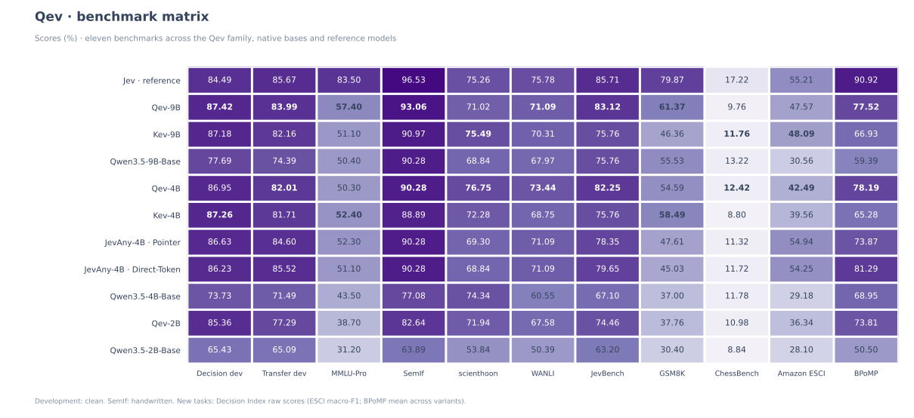

# Evaluation: results, methods and provenance

These results describe Qev-9B v0.3.0: Qwen3.5-9B-Base with rank-64 LoRA, candidate interaction, a two-layer decision head and 4K context. The main set includes 2,230 Principle judgments and 1,422 web-action records. The 2,883-record late set adds alignment, document rules, 600 boundary questions and 500 rule/reasoning questions, mixed into the second half of training and repeated three times.

This guide collects the full benchmark matrix, model comparisons, scoring methods, reproduction commands, architecture ablations and original result files. Last checked: 2026-10-04.

Qev-2B uses probability distillation followed by context edits, original-question replay and representation-response matching. Its MMLU-Pro accuracy is 38.70%, and its public JevBench accuracy is 172/231 (74.46%). Both 2B models use BF16 backbone computation. See the [training method](distillation.md).

Qev-4B v0.1.0 starts directly from Qwen3.5-4B-Base and learns teacher probabilities for 2,786 steps. It scores 503/1,000 on MMLU-Pro and 190/231 on public JevBench. The [4B recipe](training-4b.md) uses the teacher now published as Qev-9B v0.3.0 and a different input mixture from the other releases. The native Qwen3.5-4B-Base baseline scores 43.50% on MMLU-Pro and 155/231 on JevBench, using its original language-model head.

## Models and sources

| Model | Identity | Result source |
|---|---|---|
| Qev-9B | Qwen3.5-9B-Base + rank-64 LoRA + 256×2 head, seed 17, step 2658 | Local BF16 full causal reference execution |
| Kev-9B | [jaredpalmer/kev-9b](https://huggingface.co/jaredpalmer/kev-9b) | JevBench rerun locally with Kev's own `kev.benchmark`, FP32 and T=1; other suites from pinned author reports |
| Qwen3.5-9B-Base | [Qwen3.5-9B-Base](https://huggingface.co/Qwen/Qwen3.5-9B-Base) | Frozen native LM head, zero-shot prompt, probabilities normalized over valid answer codes |
| Qev-4B | Qwen3.5-4B-Base + rank-64 LoRA + 256×2 head, seed 17, step 2786 | Recorded BF16 full causal reference execution |
| Qwen3.5-4B-Base | Qwen3.5-4B-Base at `710fd005` | BF16 native LM head, zero-shot candidate codes |
| Kev-4B | [jaredpalmer/kev-4b](https://huggingface.co/jaredpalmer/kev-4b) at `139fdd9`; Kev code `5920c5f` | Author inference implementation, FP32, T=1, unmerged adapter |
| JevAny-4B Pointer / Direct-Token | [Pointer](https://huggingface.co/SimpleJev/JevAny-Qwen3.5-4B-LoRA) / [Direct-Token](https://huggingface.co/SimpleJev/JevAny-Qwen3.5-4B-Direct-Token-LoRA), code `33cb677` | Post-trained Qwen3.5-4B base, author exact FP32 inference path |
| Qev-2B | Qwen3.5-2B-Base + rank-64 LoRA + 256×2 head; no candidate preview | Recorded reference execution after response distillation |
| Qwen3.5-2B-Base | Original language-model head, zero-shot candidate codes | Recorded native-base evaluation |
| Jev | Hosted service; JevBench used Jev 1.13.0 | JevBench API run on 2026-09-26; older suites from Jev reports preserved by the Kev authors; new tasks from the pinned Decision Index 0.2.1 board |

Kev's published results are available in its [evaluation reports](https://github.com/jaredpalmer/kev/tree/557598fced1dada75dfbf36ed144dce309ac6ceb/runs). JevBench was evaluated locally for Qev, Kev, and the Qwen base, and through the Jev API for the hosted reference.

## Benchmark matrix



## Full accuracy table

Percent accuracy. Each released Qev model is a single seed. Bold scores mark the higher result between Qev-9B and Kev-9B; ties are unbolded. Jev is a hosted reference.

**Precision comparison: Kev and JevAny use FP32; Qev-9B, Qev-4B and Qev-2B use BF16 backbone computation.** Qev retains FP32 for its decision head and key reductions; its exported LoRA tensors are stored in FP32. These are not identical precision settings.

| Scope | Jev (reference) | Qev-9B | Kev-9B | Qwen3.5-9B-Base | Qev-4B | JevAny-4B Pointer | Qwen3.5-4B-Base | Qev-2B | Qwen3.5-2B-Base |
|---|---:|---:|---:|---:|---:|---:|---:|---:|---:|
| JevBench public · 231 | 85.71 | **80.95** | 75.76 | 75.76 | 82.25 | 78.35 | 67.10 | 74.46 | 63.20 |
| decision_dev all · 1468 | 83.17 | **88.28** | 87.81 | 75.75 | 87.60 | 87.26 | 71.53 | 86.24 | 63.15 |
| decision_dev clean · 1264 | 84.49 | **87.58** | 87.18 | 77.69 | 86.95 | 86.63 | 73.73 | 85.36 | 65.43 |
| transfer_dev all · 764 | 84.69 | **82.33** | 81.15 | 73.43 | 80.89 | 85.60 | 70.29 | 76.44 | 64.53 |
| transfer_dev clean · 656 | 85.67 | **83.69** | 82.16 | 74.39 | 82.01 | 84.60 | 71.49 | 77.29 | 65.09 |
| MMLU-Pro · 1,000 | 83.50 | **56.50** | 51.10 | 50.40 | 50.30 | 52.30 | 43.50 | 38.70 | 31.20 |
| SemIf · 144 handwritten | 96.53 | **93.75** | 90.97 | 90.28 | 90.28 | 90.28 | 77.08 | 82.64 | 63.89 |
| scienthoon · 873 | 75.26 | 74.80 | **75.49** | 68.84 | 76.75 | 69.30 | 74.34 | 71.94 | 53.84 |
| WANLI · 256 | 75.78 | **75.00** | 70.31 | 67.97 | 73.44 | 71.09 | 60.55 | 67.58 | 50.39 |

The all-question dev rows include clean examples and candidate-permutation / None-present / None-absent variants. Clean rows match the clean reporting convention in Kev's README. SemIf uses 144 handwritten questions. Qev's broader 252-question research run also included 108 perturbations; its 96.43% overall score is not the 144-question comparison above.

## 4B model comparison

All rows use the same reporting scopes as the README. Bold compares Qev-4B with Kev-4B; Jev and JevAny are references. The cover uses the standard JevAny Pointer release consistently across all tasks; the Direct-Token variant is also shown here.

| Benchmark | Jev (reference) | Qev-4B | Kev-4B | JevAny-4B Pointer | JevAny-4B Direct-Token | Qwen3.5-4B-Base |
|---|---:|---:|---:|---:|---:|---:|
| JevBench public · 231 | 85.71 | **82.25** | 75.76 | 78.35 | 79.65 | 67.10 |
| Decision development · clean | 84.49 | 86.95 | **87.26** | 86.63 | 86.23 | 73.73 |
| Transfer development · clean | 85.67 | **82.01** | 81.71 | 84.60 | 85.52 | 71.49 |
| MMLU-Pro · 1,000 | 83.50 | 50.30 | **52.40** | 52.30 | 51.10 | 43.50 |
| SemIf · 144 handwritten | 96.53 | **90.28** | 88.89 | 90.28 | 90.28 | 77.08 |
| scienthoon · 873 | 75.26 | **76.75** | 72.28 | 69.30 | 68.84 | 74.34 |
| WANLI · 256 | 75.78 | **73.44** | 68.75 | 71.09 | 71.09 | 60.55 |
| GSM8K · multiple choice | 79.87 | 54.59 | **58.49** | 47.61 | 45.03 | 37.00 |
| ChessBench · 5,000 | 17.22 | **12.42** | 8.80 | 11.32 | 11.72 | 11.78 |
| BPoMP · variant mean | 90.92 | **78.19** | 65.28 | 73.87 | 81.29 | 68.95 |

Qev-4B and Kev-4B start from Qwen3.5-4B-Base; JevAny uses the post-trained Qwen3.5-4B base. Qev uses BF16 backbone computation, while the Kev and JevAny runs use FP32. These are model comparisons, with different training data and objectives, rather than isolated architecture comparisons.

## Decision Index 0.2.1

The three displayed additional benchmarks use the toolkit's official **raw** score, multiplied by 100. BPoMP averages accuracy across poem variants. GSM8K averages the four-choice and ten-choice tracks; ChessBench accepts all tied best moves.

| Benchmark | Jev (reference) | Qev-9B | Kev-9B | Qwen3.5-9B-Base | Qev-4B | JevAny-4B Pointer | Qwen3.5-4B-Base | Qev-2B | Qwen3.5-2B-Base |
|---|---:|---:|---:|---:|---:|---:|---:|---:|---:|
| GSM8K · multiple choice | 79.87 | **61.75** | 46.36 | 55.53 | 54.59 | 47.61 | 37.00 | 37.76 | 30.40 |
| ChessBench · 5,000 | 17.22 | 10.34 | **11.76** | 13.22 | 12.42 | 11.32 | 11.78 | 10.98 | 8.84 |
| BPoMP · variant mean | 90.92 | **81.03** | 66.93 | 59.39 | 78.19 | 73.87 | 68.95 | 73.81 | 50.50 |

### Toolkit and score definitions

The additional evaluations use the official [Decision Index toolkit](https://github.com/apolinario/decision-index/tree/87d4650b42b377c0291a89c1f1a879f9b31082bf), pinned at `87d4650b42b377c0291a89c1f1a879f9b31082bf`. Results were recorded on 2026-10-03 for the released Qev-2B, Qev-4B and Qev-9B checkpoints, their native Qwen bases, Kev-4B/9B and both JevAny-4B variants.

The result tables and matrix display GSM8K, ChessBench and BPoMP using **official raw scores × 100**. The cover includes ChessBench and BPoMP. The [machine-readable results](../results/decision-index.json) also preserve chance-adjusted skill, coverage and individual tracks. These metrics remain separate from the original suites' integer correct-answer counts in [benchmarks.json](../results/benchmarks.json).

| Benchmark | Inputs | Raw score used in the figures |
|---|---:|---|
| GSM8K | 1,319 source questions, each presented with 4 and 10 options: 2,638 requests | Mean accuracy of the two tracks |
| ChessBench | 5,000 chess positions | Best-move accuracy, accepting tied optimal moves |
| BPoMP | 5,000 poetry questions | Accuracy computed separately for each poem variant, then averaged |

The [official scorer](https://github.com/apolinario/decision-index/blob/87d4650b42b377c0291a89c1f1a879f9b31082bf/decision_index/scoring/index.py) defines these aggregations. In particular, BPoMP's raw score differs from simply dividing the total correct answers by 5,000. Skill is chance-adjusted separately; it is not the value plotted in the cover chart.

### Inputs and scoring

The inputs were rebuilt with the toolkit from its pinned public sources: `openai/gsm8k`, DeepMind's `searchless_chess` and the BPoMP poetry data. The official rebuild includes both GSM8K choice tracks. Requests preserve the complete state, questions, candidate IDs, candidate order and expected answers; all local models answered all requests in these evaluations.

Predictions are converted to the toolkit's result format and scored using its `score_panel` and `index02.benchmark_value` functions. The benchmarks are scored individually; this release does not report a full Decision Index composite score. The original four-benchmark publication, including ESCI, was verified by rerunning the scorer on all ten local models' saved outputs: all 40 raw/skill/coverage results matched. The four current Qev-9B v0.3.0 scores were separately verified from its saved outputs with the same scorer. That complete record remains in the machine-readable results; ESCI is omitted from the displayed comparisons.

The suite's rows are not redistributed here. Use the [upstream rebuild instructions](https://github.com/apolinario/decision-index/tree/87d4650b42b377c0291a89c1f1a879f9b31082bf) to obtain the inputs. This repository publishes aggregate results and provenance.

### Inference and reference sources

- Qev uses the released checkpoints: **2B v0.1.0**, **4B v0.1.0**, **9B v0.3.0**, with BF16 backbone computation, an FP32 decision head, temperature 1 and full causal reference execution.
- Native Qwen bases use their original language-model heads, zero-shot candidate-code prompts and BF16 computation. The 4B baseline is `Qwen/Qwen3.5-4B-Base@710fd005d44d55ee27b7ad5147e318e546efdbfe`.
- Kev uses the author's inference implementation in FP32 with unmerged adapters and temperature 1. The 4B run uses `jaredpalmer/kev-4b@139fdd9` and Kev code `5920c5f`; the 9B run uses `jaredpalmer/kev-9b@2629c06a` and code `557598f`.
- JevAny's [Pointer](https://huggingface.co/SimpleJev/JevAny-Qwen3.5-4B-LoRA) and [Direct-Token](https://huggingface.co/SimpleJev/JevAny-Qwen3.5-4B-Direct-Token-LoRA) models use the author's `33cb677` inference code in FP32. Their base is the post-trained Qwen3.5-4B. The cover uses **Pointer** for every benchmark; both variants are included in the detailed results.
- Jev 1.13.0 is a published reference from the toolkit's [frozen 0.2.1 leaderboard](https://github.com/apolinario/decision-index/blob/87d4650b42b377c0291a89c1f1a879f9b31082bf/tests/fixtures/board-0.2.1.json). Its reference scores were not produced by a new API run for Qev.

### Interpretation

GSM8K here is a multiple-choice adaptation. Its [deterministic distractor builder](https://github.com/apolinario/decision-index/blob/87d4650b42b377c0291a89c1f1a879f9b31082bf/decision_index/suite/build/adapters_selection.py) creates alternatives using arithmetic transformations of the correct answer. An option-only audit found a strong shortcut in these relationships. These scores should therefore not be presented as standard free-response GSM8K reasoning performance.

The comparisons use one recorded run per model. Training data, initial bases and inference precision differ. Original benchmark results remain attached to their original runs; later numerical spot checks do not replace them selectively.

## Public JevBench breakdown

| Subset | Questions | Qev-9B correct | Kev-9B correct | Qwen base correct | Jev correct (reference) | Qev-4B correct |
|---|---:|---:|---:|---:|---:|---:|
| original | 72 | 67 | 65 | 59 | 71 | 69 |
| easy | 48 | 48 | 48 | 48 | 48 | 48 |
| hard | 111 | 72 | 62 | 68 | 79 | 73 |
| all | 231 | 187 | 175 | 175 | 198 | 190 |

This is local argmax accuracy on the public v1.4.2 tasks. It is not the official composite score, which includes other dimensions and nonpublic tasks. The public benchmark was observed during research iteration, so these results are not an untouched final blind test.

Precision, prompts, and implementations differ across models; these are model-level observations, not a controlled architecture comparison.

## Original results and provenance

| File | Contents |
|---|---|
| [Benchmark metrics](../results/benchmarks.json) | Model identities, integer counts and accuracy for the original suites, including the matched README subsets |
| [Decision Index metrics](../results/decision-index.json) | Official raw scores, chance-adjusted skill, coverage and individual tracks |
| [Qev-9B full evaluation](../results/qev-9b/evaluation.json) | Full-suite counts and matched reporting scopes for the current 9B release |
| [Qev-9B provenance](../results/qev-9b/provenance.json) | Checkpoint version, training recipe and evaluation settings |
| [All 231 Qev-9B JevBench predictions](../results/qev-9b/jevbench-predictions.jsonl) | Per-question probabilities and predictions, without redistributing question text |
| [All model result files](../results/README.md) | Corresponding results, predictions and provenance for 2B, 4B and the comparison models |
| [Historical releases](../results/history/README.md) | Previous checkpoint results and frozen release records |

These files preserve recorded model measurements. The [validation record](validation.md) separately documents packaging, numerical checks and publication verification.

## Rerun Qev's public evaluation

Download the released checkpoint, then prepare and evaluate the public tasks:

```bash
hf download AustinFu/Qev-9B --revision v0.3.0 --local-dir checkpoints/qev-9b

python scripts/prepare_jevbench.py \
  --root data/jevbench --source-dir data/jevbench/source \
  --tokenizer checkpoints/qev-9b/tokenizer --config configs/qev-9b.json

python -m qev.evaluate --checkpoint checkpoints/qev-9b \
  --data data/jevbench/model_data/jevbench-public-v1.4.2 --split public \
  --out runs/jevbench-reference --device cuda \
  --reference --weights-dtype checkpoint --max-state 4096 --max-path 4096
```

The preparer downloads JevBench v1.4.2, retains the original answers and probability targets, and keeps all 231 public tasks. Every exported view has an `external_evaluation` role. Re-running the preparation command on its completed directory verifies it instead of replacing it. Use `--compare-data` to audit canonical input overlap with supplied training datasets.

To evaluate a prepared user-data dev split:

```bash
python -m qev.evaluate --checkpoint runs/support/step-000100 \
  --data data/support --split dev --out runs/support-eval \
  --reference --weights-dtype checkpoint
```

Use an actual saved step. Reports preserve rejected items and both answered-only accuracy and accuracy counting rejections wrong. Probability checks, Brier, NLL and ECE are also computed; their availability does not mean the released checkpoint has been calibrated.

## Architecture ablations

These historical ablations use the Qev-9B v0.1.0 data recipe, rank 64, seed 17 and final step 2327. Their results remain separate from the current v0.3.0 leaderboard. The released 9B models retain the full interaction architecture.

| Variant | Backbone sibling cross | Set attention layers | JevBench correct | Mean P(gold label) |
|---|---|---:|---:|---:|
| Qev-9B v0.1.0 reference | All sibling tokens | 2 | 188/231 | 0.782 |
| No backbone interaction | Off | 2 | 185/231 | 0.775 |
| No set attention | All sibling tokens | 0 | 189/231 | 0.791 |
| Neither interaction | Off | 0 | 187/231 | 0.780 |
| Readout-only | Sibling readout tokens | 2 | 187/231 | 0.784 |

The single-seed comparisons did not establish a measurable gain from either interaction component. Projection and the scalar scorer remain even when set attention is disabled. Related rank-16 seed sweeps had a JevBench standard deviation of about 4.7 questions; that is context, not a confidence interval or significance test for this final recipe.

scienthoon questions cluster by ticket template, so treating every question as an independent observation understates uncertainty. Jev's large knowledge-benchmark advantage does not identify its undisclosed model architecture or training data. No speed superiority or probability-calibration superiority is claimed by this release.
